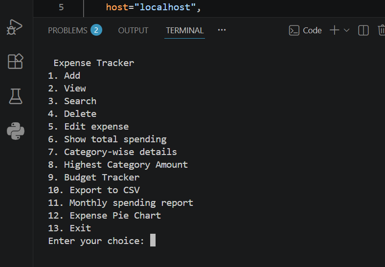
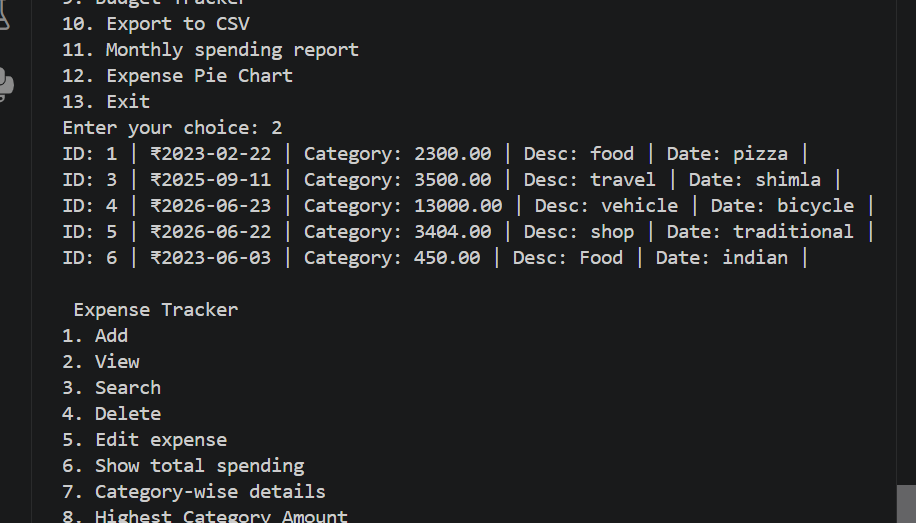
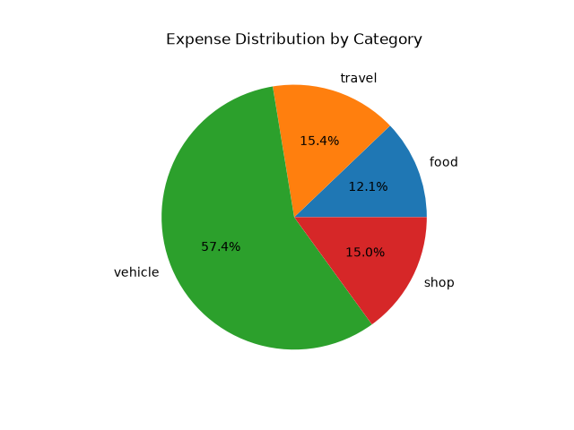

# 💰 Expense Tracker

A command-line Expense Tracker developed using **Python**, **MySQL**, and **Matplotlib**. This application helps users record, manage, and analyze their expenses through features such as budget tracking, category-wise summaries, monthly reports, CSV export, and graphical visualizations.

---

## ✨ Features

* ➕ Add a new expense
* 📋 View all expenses
* 🔍 Search expenses by category
* ✏️ Edit existing expenses
* 🗑️ Delete expenses
* 💰 Display total spending
* 📊 Category-wise expense summary
* 🏆 Highest spending category
* 📅 Monthly spending report
* 💵 Monthly budget tracker
* 📤 Export expenses to CSV
* 🥧 Expense distribution pie chart

---

## 🛠️ Technologies Used

* Python
* MySQL
* MySQL Connector
* Matplotlib
* CSV

---

## 📁 Project Structure

```text
Expense-Tracker/
│── expense_tracker.py
│── database.sql
│── requirements.txt
│── README.md
│── screenshots/
```

---

## 🚀 How to Run

1. Clone the repository.

```bash
git clone https://github.com/tarasha-26/Expense-Tracker.git
```

2. Install the required packages.

```bash
pip install -r requirements.txt
```

3. Create the MySQL database using `database.sql`.

4. Update your MySQL username and password in `expense_tracker.py`.

5. Run the application.

```bash
python expense_tracker.py
```

---

## 📸 Screenshots

### Main Menu



### Expense List



### Expense Pie Chart


---

## 🚀 Future Improvements

* Flask web application
* User authentication
* Interactive dashboard
* Date range filters
* Monthly analytics
* PDF report generation

---

## 👩‍💻 Author

**Tarasha**
